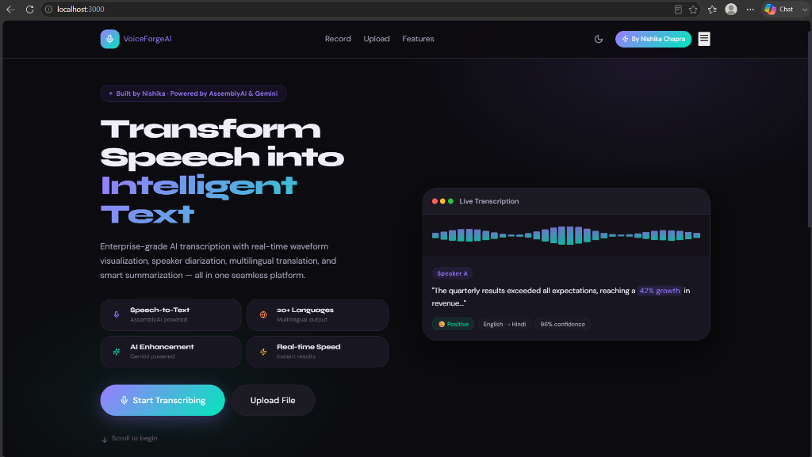
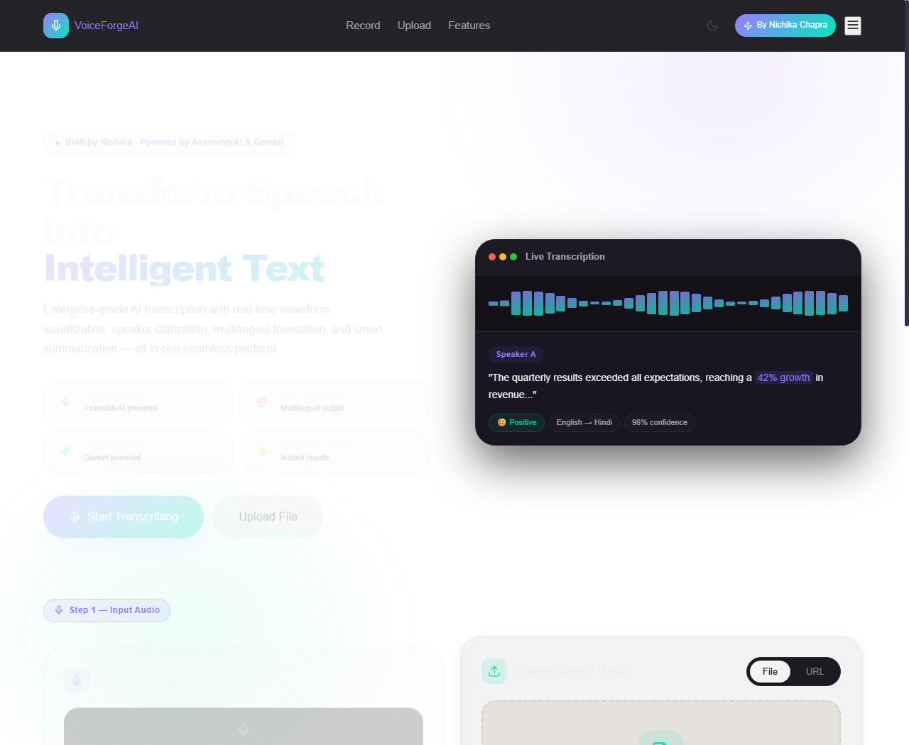
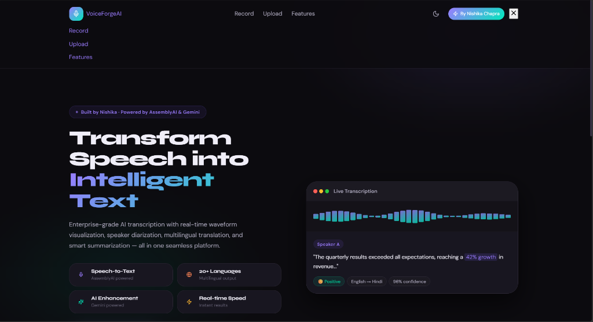
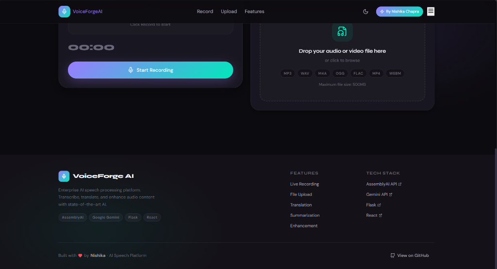

# 🎙️ VoiceForge AI — Advanced Speech Processing & Enhancement Platform

> **Next-generation AI speech processing platform** powered by AssemblyAI's state-of-the-art transcription models and Google Gemini's advanced language models. 
> 
> *Built with passion by **Nishika***

[](https://react.dev)
[](https://vitejs.dev)
[](https://python.org)
[](https://flask.palletsprojects.com)
[](https://assemblyai.com)
[](https://ai.google.dev)
[](https://opensource.org/licenses/MIT)

---

## 🖥️ Platform Interface

### Dashboard & Active Interface
| 🌟 Dark Mode Landing Page | 📊 Audio Waveform & Speech AI Dashboard |
|---|---|
|  |  |

### Local Running Interface
| 🎙️ Live Recording & Upload Controls | ⚙️ Responsive Dropdown Navigation |
|---|---|
|  |  |

| 🏷️ Footer & Technology Directory |
|---|
|  |

---

## ✨ Core Features

### 1. High-Performance Audio Input
*   **Live Waveform Recording**: Capture voice audio directly in the browser with real-time waveform visualizers using HTML5 Canvas & Web Audio API.
*   **Universal File Upload**: Seamless drag-and-drop file upload supporting `.mp3`, `.wav`, `.m4a`, `.ogg`, `.flac`, `.mp4`, `.webm`, and `.aac`.

### 2. State-of-the-Art Speech-to-Text
*   **AssemblyAI Universal-2 Model**: Transcribe audio files or URLs with industry-leading accuracy.
*   **Speaker Diarization**: Detect multiple speakers and partition transcripts into custom dialogue segments (Speaker A, Speaker B, etc.) with precise timestamps.
*   **Automated Formatting**: Automatic punctuation and smart text formatting out of the box.

### 3. Intelligent AI Analytics (Powered by Google Gemini)
*   **Contextual Translation**: Translate transcripts instantly into 20+ global languages (Hindi, Spanish, French, Chinese, Japanese, etc.) preserving local idiom and tone.
*   **Summarization Matrix**: Condense speech into 4 customizable styles: *Concise Summary*, *Detailed Paragraph*, *Bulleted Highlights*, or *Executive Brief*.
*   **Text Enhancement**: Rephrase and correct transcripts on-the-fly to fit different styles (*Grammar & Clarity*, *Formal Tone*, *Casual Tone*, or *Technical Tone*).
*   **Linguistic Analysis**: Deep analysis pipeline extracting sentiment indicators, key discussion topics, entities, and action items.

---

## 🛠️ Technology Stack

| Layer | Technologies |
| :--- | :--- |
| **Frontend** | React 18, Vite, Canvas API (Waveform), Wavesurfer.js, Lucide Icons, Axios |
| **Backend** | Flask (Python), Flask-CORS, python-dotenv, Gunicorn |
| **AI Processing** | AssemblyAI Python SDK (Speech-to-Text), Google Generative AI (Gemini 2.0 / 1.5) |

---

## 🚀 Local Development Setup

### Prerequisites
*   **Python** 3.10 or higher
*   **Node.js** 18 or higher (with `npm`)
*   **AssemblyAI API Key** &rarr; [Get one free](https://www.assemblyai.com/app/)
*   **Google Gemini API Key** &rarr; [Get one free](https://aistudio.google.com/app/apikey)

### Step 1: Clone the Repository
```bash
git clone https://github.com/YOUR_USERNAME/voiceforge-ai.git
cd voiceforge-ai/speech-ai-platform
```

### Step 2: Configure & Start the Backend
1. Navigate to the backend directory:
   ```bash
   cd backend
   ```
2. Create and activate a Python virtual environment:
   ```bash
   python -m venv venv
   # On Windows (PowerShell):
   .\venv\Scripts\Activate.ps1
   # On macOS/Linux:
   source venv/bin/activate
   ```
3. Install dependencies:
   ```bash
   pip install -r requirements.txt
   ```
4. Copy the environment variables template and fill in your API keys:
   ```bash
   cp .env.example .env
   ```
   *Edit `.env` and configure keys:*
   ```env
   ASSEMBLYAI_API_KEY=your_assembly_ai_key_here
   GEMINI_API_KEY=your_gemini_key_here
   ```
5. Run the Flask development server:
   ```bash
   python app.py
   # Backend starts on http://localhost:5000
   ```

### Step 3: Configure & Start the Frontend
1. Open a new terminal and navigate to the frontend directory:
   ```bash
   cd speech-ai-platform/frontend
   ```
2. Install Node packages:
   ```bash
   npm install
   ```
3. Start the Vite development server:
   ```bash
   npm run dev
   # Frontend starts on http://localhost:3000
   ```
4. Open your browser and head to `http://localhost:3000` to start transcribing! 🎉

---

## 🌐 API Reference

### 1. Health Check
*   **Endpoint**: `GET /api/health`
*   **Description**: Returns service health status and API version.
*   **Response**:
    ```json
    {
      "status": "ok",
      "message": "VoiceForge AI is running",
      "version": "1.0.0"
    }
    ```

### 2. Audio Upload & Transcription
*   **Endpoint**: `POST /api/upload`
*   **Content-Type**: `multipart/form-data`
*   **Parameters**:
    *   `audio` (File): Audio file (mp3, wav, m4a, etc.)
    *   `speaker_labels` (string, optional): `"true"` or `"false"` (default: `"true"`)
    *   `auto_chapters` (string, optional): `"true"` or `"false"` (default: `"false"`)
    *   `sentiment_analysis` (string, optional): `"true"` or `"false"` (default: `"false"`)
    *   `entity_detection` (string, optional): `"true"` or `"false"` (default: `"false"`)
*   **Response**:
    ```json
    {
      "id": "transcription-id-12345",
      "status": "completed",
      "text": "Hello, welcome to VoiceForge AI.",
      "confidence": 0.985,
      "audio_duration": 4.5,
      "language_code": "en_us",
      "words": [...],
      "utterances": [...]
    }
    ```

### 3. Transcribe Audio via URL
*   **Endpoint**: `POST /api/transcribe/url`
*   **Content-Type**: `application/json`
*   **Payload**:
    ```json
    {
      "url": "https://example.com/audio.mp3",
      "speaker_labels": true
    }
    ```
*   **Response**: Same as `/api/upload` schema.

### 4. Translate Transcript
*   **Endpoint**: `POST /api/translate`
*   **Content-Type**: `application/json`
*   **Payload**:
    ```json
    {
      "text": "Hello, welcome to VoiceForge AI.",
      "target_language": "Spanish",
      "source_language": "auto"
    }
    ```
*   **Response**:
    ```json
    {
      "translated_text": "Hola, bienvenido a VoiceForge AI."
    }
    ```

### 5. Summarize Transcript
*   **Endpoint**: `POST /api/summarize`
*   **Content-Type**: `application/json`
*   **Payload**:
    ```json
    {
      "text": "Long meeting discussion transcript...",
      "style": "bullet_points"
    }
    ```
*   **Response**:
    ```json
    {
      "summary": "- Key decision reached to move backend to Flask.\n- Added Gemini models."
    }
    ```

---

## 📁 Directory Structure

```text
voiceforge-ai/
├── backend/
│   ├── app.py                    # Flask API Server Gateway
│   ├── requirements.txt          # Python package requirements
│   ├── .env.example              # Template config file
│   └── utils/
│       ├── assemblyai_handler.py # Speech transcription handler
│       └── gemini_handler.py     # AI translation/summary/enhancement handler
│
├── frontend/
│   ├── index.html                # HTML entry point
│   ├── package.json              # Project package definitions
│   ├── vite.config.js            # Vite settings & proxy configuration
│   ├── public/
│   │   └── favicon.svg           # Application logo
│   └── src/
│       ├── App.jsx               # Application core wrapper
│       ├── main.jsx              # React mounting root
│       ├── index.css             # Main styling, design system & themes
│       ├── api/
│       │   └── speechApi.js      # Axios API handler
│       ├── hooks/
│       │   ├── useTheme.js       # Dark, Light & System theme controller
│       │   └── useAudioRecorder.js # Microphone hardware controller
│       └── components/
│           ├── Header.jsx        # Navigation bar & theme switchers
│           ├── Hero.jsx          # Feature description panel
│           ├── AudioRecorder.jsx # Live recording capture panel
│           ├── FileUploader.jsx  # Drag-and-drop media uploader
│           ├── TranscriptionPanel.jsx # Output transcript visualizer
│           ├── TranslationPanel.jsx   # Multilingual output panel
│           ├── SummaryPanel.jsx       # Summarization engine
│           ├── EnhancementPanel.jsx   # Proofreader and tone tuner
│           └── AnalysisPanel.jsx      # Deep text analyser
│
├── assets/
│   ├── landing_page_mockup.png   # Frontend screenshot (landing)
│   └── dashboard_mockup.png      # Frontend screenshot (dashboard)
├── .gitignore
├── README.md                     # Documentation
└── DEPLOY.md                     # Deployment Guide
```

---

## 🚢 Production Deployment

For complete details on deployment platforms, settings, CORS policies, and environments, check out [DEPLOY.md](./DEPLOY.md):
*   **Backend Hosting**: Render, Railway, or Heroku.
*   **Frontend Hosting**: Vercel, Netlify, or AWS Amplify.

---

## 📜 License & Credits

*   Distributed under the **MIT License**. See `LICENSE` for more information.
*   Speech models powered by [AssemblyAI](https://www.assemblyai.com).
*   AI analysis models powered by [Google Gemini API](https://ai.google.dev).
*   Built and maintained by **Nishika**.
